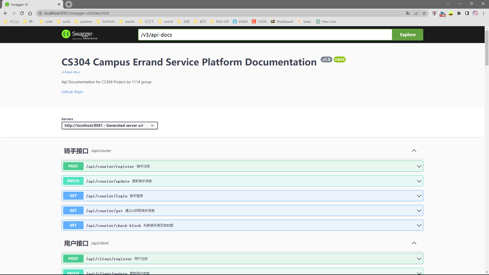
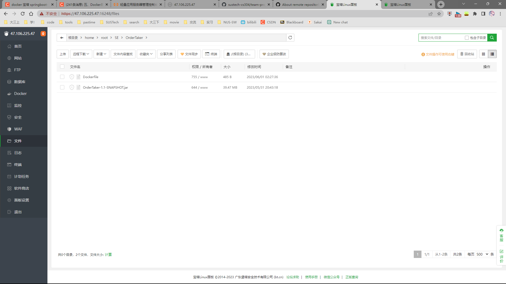
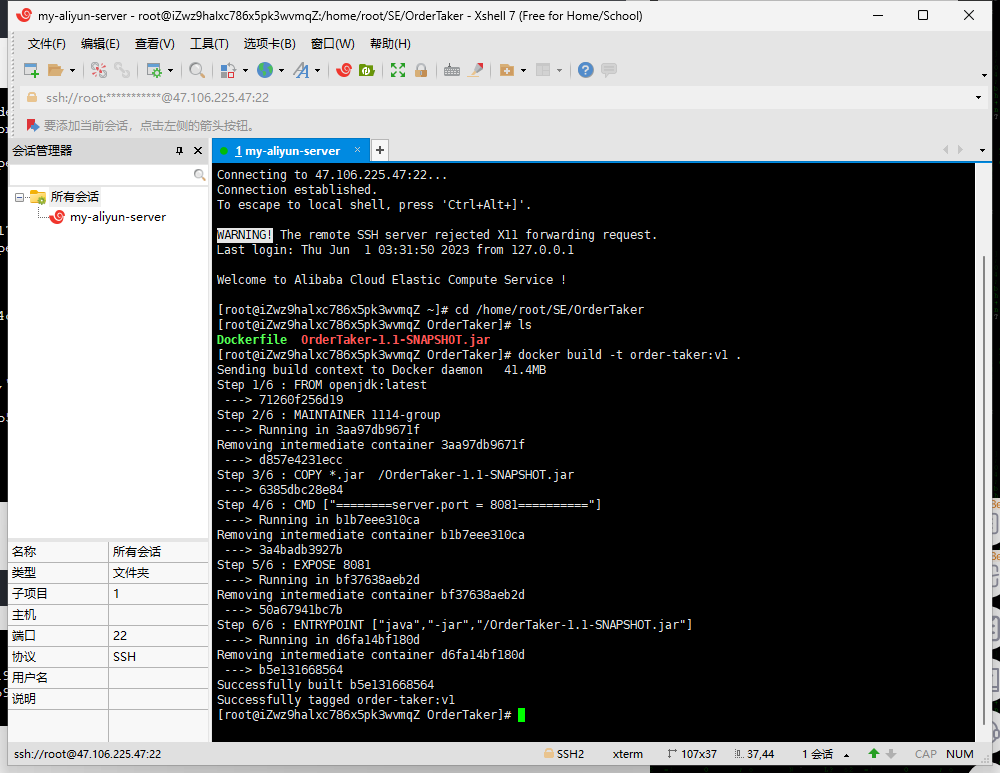
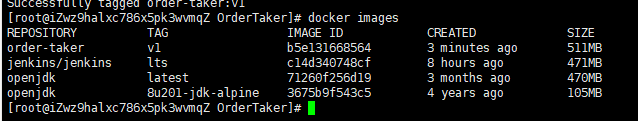
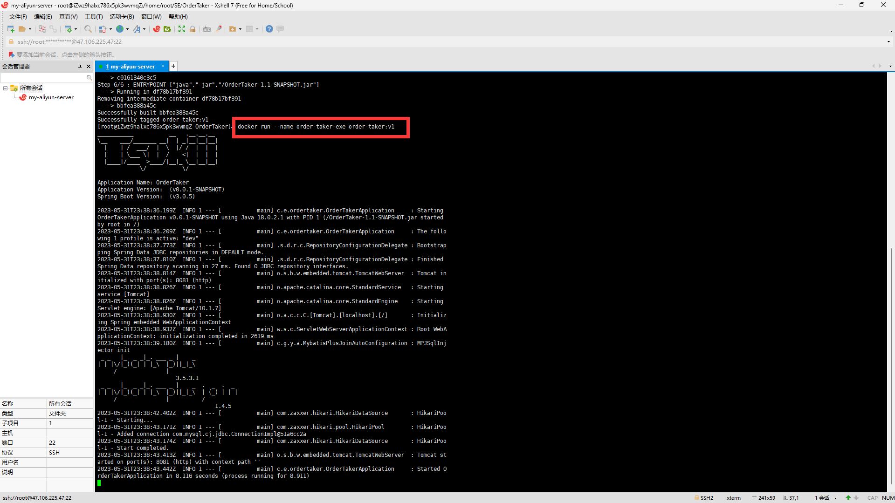

# [CS304] Final Report
Project Name: Campus Errand Service Platform
Project members: Zeng Xianqing, Chen Wenyan, Ye Qingyang, Peng Shubo, Lin Yuhang
## 1. Metrics
### 1.1 complexity of our project
| back/front | Lines of Code | Number of modules/subprojects | Number of packages | Number of source files | Number of 3rd party dependencies |
| :--------: | :-----------: | :---------------------------: | :----------------: | :--------------------: | :------------------------------: |
|  Backend   |     5289      |               1               |         10         |           69           |                18                |
|  Frontend  |     16896     |               1               |         6          |          545           |                1                 |

### 1.2 maintainability of our project
We found a mini-program which has features similar to a campus on GitHub. This repository has 516 stars and 121 forks. And its url is https://github.com/Xin-Felix/Mango.
|      team       | back/front | Lines of Code | Number of modules/subprojects | Number of packages | Number of source files | Number of 3rd party dependencies |
| :-------------: | :--------: | :-----------: | :---------------------------: | :----------------: | :--------------------: | :------------------------------: |
|    team-1114    |  Backend   |     5289      |               1               |         10         |           66           |                18                |
|    team-1114    |  Frontend  |     16896     |               1               |         6          |          545           |                1                 |
| Xin-Felix/Mango |  Backend   |     3662      |               1               |         7          |           76           |                10                |
| Xin-Felix/Mango |  Frontend  |     1088      |               1               |         5          |           89           |                1                 |

From the provided data, we can see that in terms of lines of code, team-1114 has a larger codebase both for backend (5289 vs. 3662) and frontend (16896 vs. 1088). Additionally, team-1114 has more packages and source files compared to Xin-Felix/Mango for both backend and frontend. In some sense, our project is more complexity than Xin-Felix/Mango.

## 2. Documentation
### 2.1 Documentation for end users
- Refer to [User-Readme.md](./User-Readme.md)

- sample: 

- Description: our documentation for end users provided some instructions for using our Campus Errand Platform in the aspects of account management, main functions of placing/taking order and checking order for clients/couriers, as well as some auxiliary functions such as personal information management and address information management.

### 2.2 Documentation for developers
- Refer to [Dev-api.pdf](./Dev-api.pdf) or http://47.106.225.47:8081/swagger-ui/index.html#/
- sample:

.png)
.png)

- Description:
    The API documentation generated by Swagger3 is designed for developers, with the primary purpose of helping developers, collaborators, or potential future contributors understand the design, purpose, and implementation of our code entities.

    In the case of our API documentation, it meticulously lists out the HTTP methods (like GET, POST, PATCH, DELETE, etc.) and corresponding parameters for various endpoints, as well as their purposes. These endpoints include Courier/Client/Admin Interface, Order Interface, and so on. Furthermore, the document describes several data models (Schemas) such as Courier, OrderTracking, Payment, Order......

    Developers can understand how to interact with these endpoints to implement related functionalities by reading this documentation. For instance, developers would understand that to register a new courier, they need to send a POST request to "/api/courier/register"; to retrieve payment status, they need to send a GET request to "/api/payment/status", and so forth. This information aids developers in understanding and utilizing the API, thereby implementing the necessary functionalities in their applications.

    Another advantage of the API documentation generated by Swagger is its readability and ease of use. Developers can see detailed information about each endpoint directly in the documentation, without having to inspect the actual code implementation. This greatly improves development efficiency and reduces the learning curve.

## 3. Test
- We mainly tested the backend code. We used squareTest to automatically generate test code, mvn test to generate the result and Jacoco to analyze the coverage. 
- Source code of related artifact for testing
the architect: 


take one test method as example:


- Test execution results
test results:


coverage report: Refer to [Jacoco_report.html](./backend/OrderTaker/jacoco/index.html)


## 4. Build
### 4.1 Front-end

Run the followings in the command line in front-end/miniapp/miniprogram
```
npm init -y
npm i @vant/weapp -S --production
```
Then remove the "style: v2" in app.json and build npm in Build npm in WeChat Developer Tools


before build:


after build:


### 4.2 Back-end


 can build and run the back-end Spring Boot project built with Maven by following the below steps:

1. Install Java and Maven:

    Ensure that there is a suitable Java Development Kit (JDK>=17) and Maven installed on the computer. 

2. Clone / Download the project:

    You can clone it using Git by 

    `git clone https://github.com/sustech-cs304/team-project-1114.git` 

    or download it directly to the local system from the url 
    
    https://github.com/sustech-cs304/team-project-1114

3. Navigate to the project directory and build the project:

    Open a terminal or IDE and navigate to the back-end directory of the project by `cd backend/OrderTaker`. This directory will contain the [pom.xml](./backend/OrderTaker/pom.xml) file for the Maven project. 
    
    Then use Maven to build the project by running the following command in the terminal:

    `mvn clean install`

    The clean command will delete the target directory with all the build data before starting so that it is fresh. The install command will **compile, test, and package** the code in a distributable format as **OrderTaker-v3.0-final.jar** and install the packaged code in the local repository.

4. Run the project in two ways:
    (1) Spring Boot Maven plugin includes a run goal which can be used to quickly compile and run application. Use the following command to start the application:

    `mvn spring-boot:run`


    (2) The final artifact produced by a successful build is an executable JAR file. This JAR file contains all the compiled classes and resources of our application, along with embedded dependencies and an embedded servlet container (like Tomcat).

    To run the built jar, you can use the java -jar command followed by the jar file name. For example:

    `java -jar ./target/OrderTaker-v3.0-final.jar`

    
    If everything is set up correctly, Spring Boot will start up, and the application will start running. Besides, we can access the developer api documentation at http://localhost:8081:api.html to check if the application is running well.


## 5. Deploy

Here's a step-by-step approach for containerizing a Spring Boot application with Docker and deploying the containerized application to a server with Xshell:

1. Using the IDE Tool "Alibaba Cloud Toolkit" to upload the `.jar` file to the server. 


2. Create a Dockerfile in our project's root directory using baota control plane:
   
The [Dockerfile](./backend/OrderTaker/Dockerfile) serves as a set of instructions for Docker to build the image:

```
FROM openjdk:latest

MAINTAINER 1114-group

# 将当前目录下的jar包复制到容器里
COPY *.jar  /java -jar ./OrderTaker-v3.0-final.jar


# 提示当前项目在容器运行的端口
CMD ["========server.port = 8081=========="]

# 暴露运行的端口
EXPOSE 8081

# 执行jar包
ENTRYPOINT ["java","-jar","/java -jar ./OrderTaker-v3.0-final.jar"]

```

3. Build the Docker image:
From Xshell terminal, navigate to the Dockerfile directory , and run the following command to build a Docker image. The -t option can tag the image so it's easier to find later using the docker images command:

    ` docker build -t order-taker:v1 .`
    
4. Verify the Docker image:
Then view the Docker image by running the following command:
`docker images`
    

5. Run the Docker container:
Finally, run the Docker container from the previous image using the following command:

    `docker run --name order-taker-exe1 order-taker:v1`

    Once we have our Docker image, on our server, we can pull the image and run a container from it. We use Xshell to connect to server over SSH, pull our Docker image, and run our container.

    
