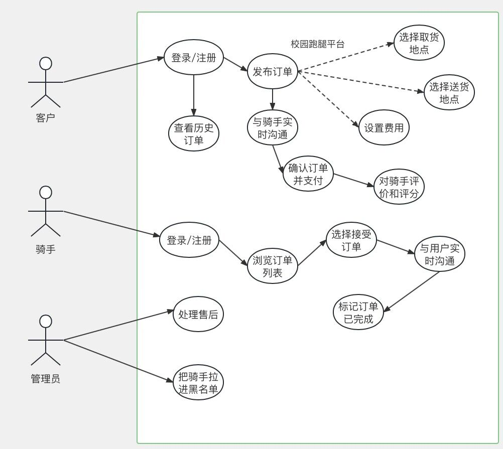
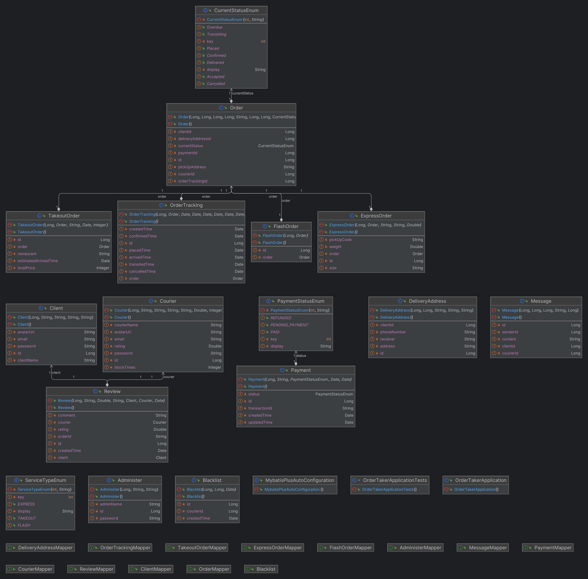
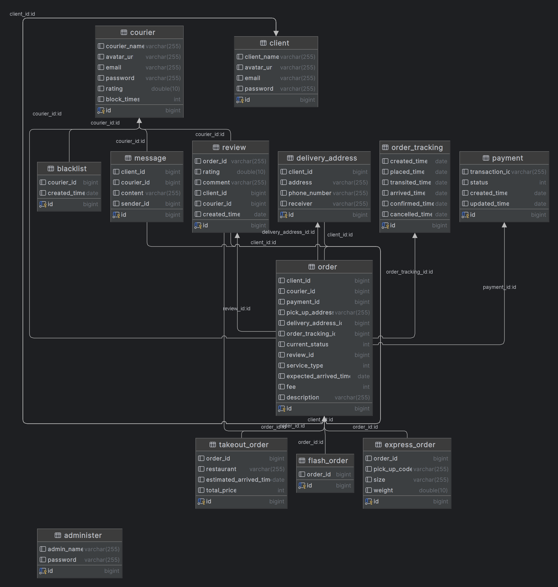
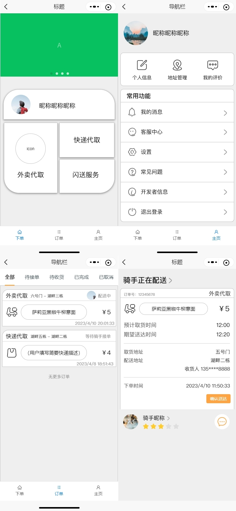
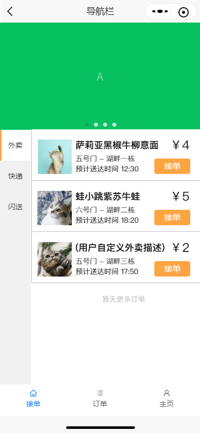
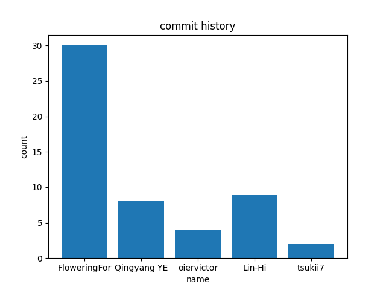
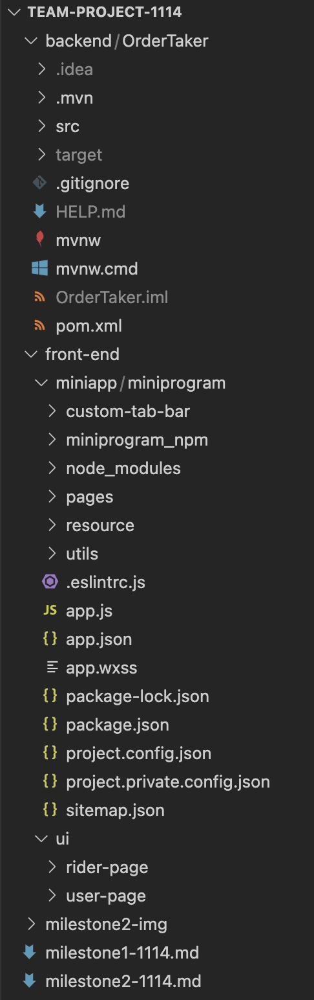

# [CS304] Requirement Analysis Report

Project Name: Campus Errand Service Platform 

Project members: Zeng Xianqing, Chen Wenyan, Ye Qingyang, Peng Shubo, Lin Yuhang

## 1. Use Case Diagram

## 2. Swimlane Diagram

## 3. Natural Language Description

**Use Case:** Complete Order

**Actors:** User (student or staff member), Courier

**Brief Description:** The courier marks the order as completed after delivering it to the destination. The user receives a delivery notification and confirms receipt of the goods. The order status is updated to completed, and payment and evaluation are completed.

**Trigger:** The courier delivers the goods to the destination.

**Preconditions:** The courier has accepted and completed the delivery of the order.

**Postconditions:** The order status is updated to completed.

**Basic Flow:**

- The courier delivers the goods to the destination.
- The courier marks the order as completed in the system.
- The system sends a notification to the user informing them that the order is completed.
- The user confirms receipt of the goods.
- The system updates the order status to completed.
- The user completes payment.
- The user can evaluate the order and rate the courier.

**Alternative Flow:**

- User doesn't confirm receipt of goods

  If the user does not confirm receipt of the goods within the specified time, the system will automatically update the order status to completed.

- Courier delivery is delayed

  The courier fails to deliver the goods to the destination within the expected delivery time.

  The system sends a notification to the user informing them of the delivery delay.

  The user can choose to wait or contact the courier to find out more information.

  The courier completes the delivery as soon as possible and marks the order as completed.

  The user confirms receipt of the goods, and the system updates the order status to completed.

**Exception Flow:**

- Courier delivers to the wrong destination:

  **a.** The courier contacts the user to obtain the correct delivery address and redeliver the goods.

  **b.** The user and courier negotiate and reach a solution for redelivery or order cancellation.

- User cannot confirm receipt of the goods:

  **a.** The user contacts the courier or customer service to resolve the issue.

  **b.** In the event that the issue cannot be resolved, the order may be canceled or suspended until the issue is resolved.

## 4. Diagrams for *Logical view*

## 5. Data Design

In the campus errands service platform, the system will handle different types of data including user information, delivery addresses, orders, order tracking information, payment information, and reviews. These data are stored in various database tables such as **Client, Courier, DeliveryAddress, Order, TakeoutOrder, ExpressOrder, FlashOrder, Review, OrderTracking, Payment, and Blacklist**, each with their own set of columns and data types. The relationships between the tables are defined through primary and foreign keys. For example, the Client and Courier tables are related to the Order table through the clientId and courierId columns, respectively. The Order table is also related to other tables such as DeliveryAddress, Payment, Review, and OrderTracking through their respective foreign keys. 
Overall, the data design is structured to support the different functionalities and requirements of the campus errands service platform.

## 6. UI Design

### 6.1 用户界面

### 6.2 骑手界面

  

## 7. Collaborations
  
 

## 8. Deliverables

So far, we have implemented the following functionalities:

- User can place an order
- User can view their personal profile page
- User can view their order history and details
- User can rate and review a completed order
- Courier can view and accept available orders
- Courier can update the delivery status of an order
- Admin can view and manage orders and users
  
The corresponding deliverables are:

- Backend database design and implementation
- UI design for basic frontend pages including user order placement, personal profile, order list and details, and courier order acceptance and delivery status updates
  

